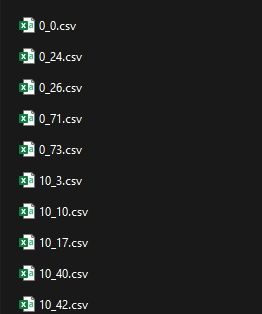

# Análise de Confiabilidade de Sistemas de Parques Eólicos

Este projeto realiza a análise de confiabilidade, manutenibilidade e disponibilidade (Reliability, Maintainability, and Availability - RMA) de componentes de três parques eólicos (Parque A, B e C). Os scripts em Python processam dados históricos de operação e falha para calcular métricas essenciais como Tempo Médio Até a Falha (MTTF), Tempo Médio Para Reparo (MTTR) e Disponibilidade Operacional.

## 📂 Estrutura do Projeto

O repositório está organizado da seguinte forma:

```
.
├── WIND FARM A/
│   └── (Arquivos de dados do Parque A)
├── WIND FARM B/
│   └── (Arquivos de dados do Parque B)
├── WIND FARM C/
│   └── (Arquivos de dados do Parque C)
│
├── ArquivoFinalConfiabilidadesPorParque.py # Script principal que realiza os cálculos e gera os arquivos CSV de resultados
├── confiabilidade_por_asset_FarmA.csv # Saída com os resultados numéricos da análise do Parque A
├── confiabilidade_por_asset_FarmB.csv # Saída com os resultados numéricos da análise do Parque B
├── confiabilidade_por_asset_FarmC.csv # Saída com os resultados numéricos da análise do Parque C
│
├── histogramasMtbfMttf.py # Script para gerar histogramas para cada Parque
├── histogramasParqueA.png # Histogramas do Parque A 
├── histogramasParqueB.png # Histogramas do Parque B
├── histogramasParqueC.png # Histogramas do Parque C
│
├── ditribuicaoDisponibilidade.py # Script para gerar o grafico de caixa das disponibilidades
└── DistribuicaoDisponibilidade.png # Gráfico de caixa das Disponibilidades
```

## ❗ Dados do Projeto

**Importante:** Os arquivos de dados brutos (em formato Excel), necessários para a execução da análise, são muito grandes e não foram incluídos neste repositório do GitHub.

Para executar os scripts, você precisa fazer o download dos dados separadamente através do link abaixo e colocar os arquivos nas suas respectivas pastas (`WIND FARM A`, `WIND FARM B`, `WIND FARM C`).

➡️ **Faça o download dos dados aqui:** https://zenodo.org/records/14958989

## 🚀 Como Executar

1.  **Clone o repositório:**

2.  **Baixe e organize os dados:**
    * Faça o download dos arquivos de dados a partir do link fornecido acima.
    * Descompacte e mova os arquivos para as pastas correspondentes (`WIND FARM A/`, `WIND FARM B/`, `WIND FARM C/`).
    * Confira se nos arquivos event_info.csv de cada Parque a coluna com o ID do *asset* é nomedada *asset_id*
    * Renomeie o arquivo .csv de cada dataset acrescentando o ID do *asset* correnpondente antes do número do evento como abaixo:

    

3.  **Instale as dependências:**

4.  **Execute a análise:**
    Execute os scripts na ordem apropriada para carregar os dados, processá-los e gerar as visualizações (execute uma vez para cada Parque, mudando os caminhos dos arquivos a serem lidos).
    ```bash
    python ArquivoFinalConfiabilidadesPorParque.py
    python histogramasMtbfMttf.py
    ```
    Execute o código abaixo para gerar o Gráfico em caixa comparando os três resultados de Disponibilidade.
    ```bash
    python ditribuicaoDisponibilidade.py
    ```


## 📊 Resultados

Os resultados numéricos da análise de confiabilidade são salvos nos arquivos `.csv` no diretório principal do projeto.

As visualizações, como os gráficos de barras para Disponibilidade, MTTF e MTTR, são salvas como arquivos `.png` no diretório principal do projeto.
